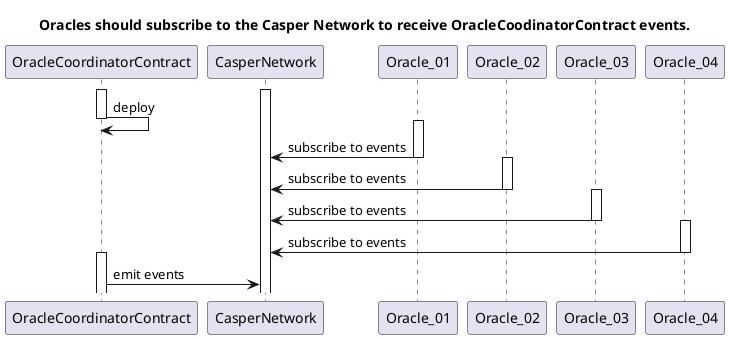
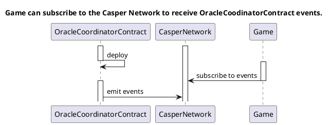
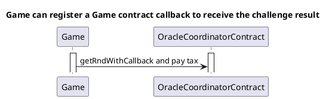
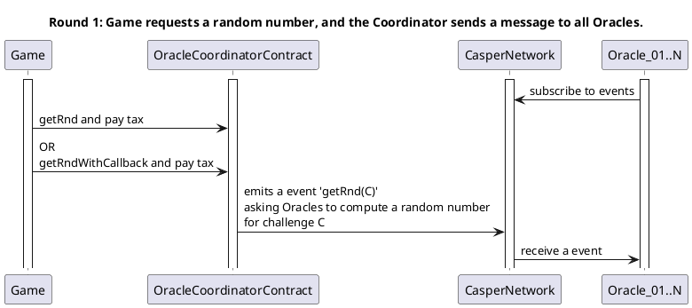
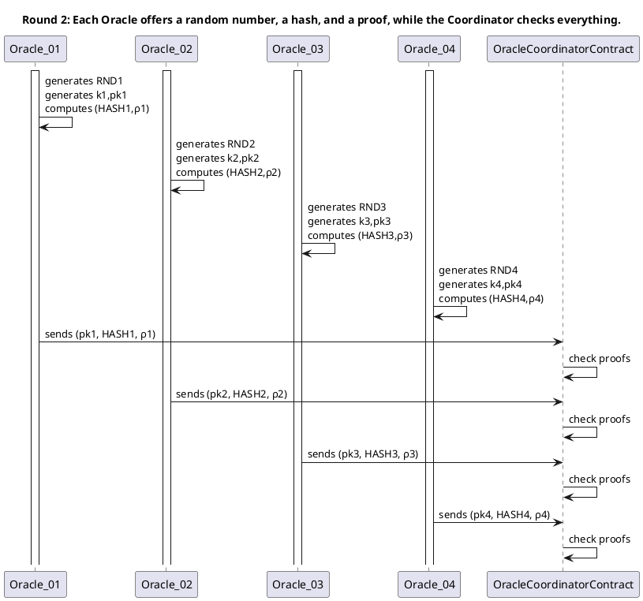
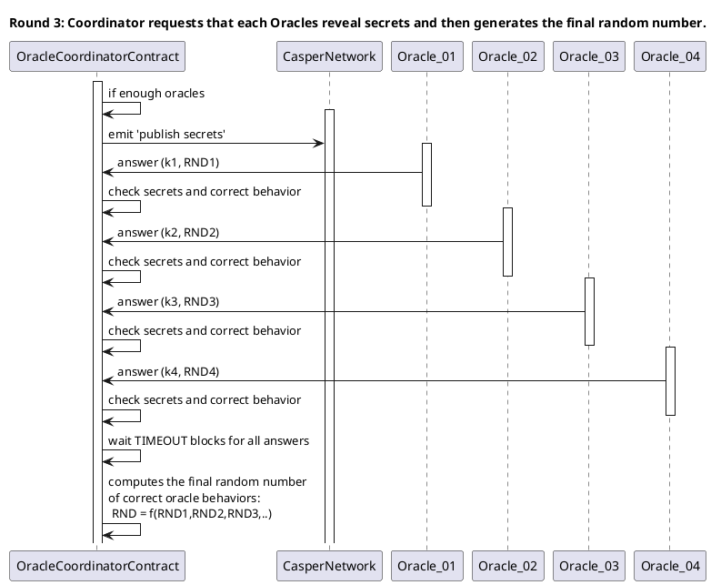
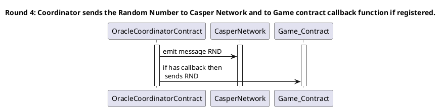
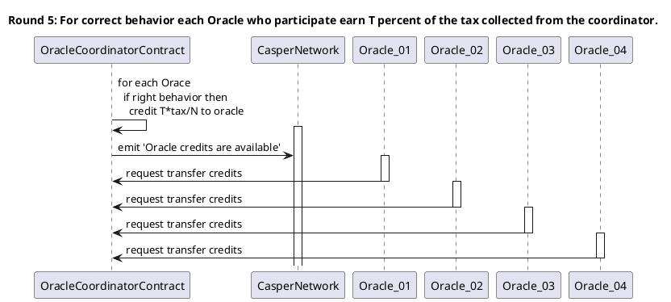
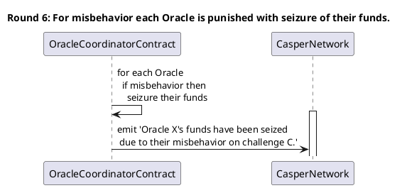

# Introduction

1. The **Game** requests a **challenge** to generates a random number and pay a *REWARD_CHALLENGE* to **reward** the Oracle participants.
2. Each **challenge** have a unique identifier ***C*** generated by the OracleCoordinatorContract;
4. The **challenge** should be taken by all **Oracles** who have been registered and active;
5. **Oracle answer timeout penalty:** If a **registered and active Oracle** does not respond before a predetermined *TIMEOUT_BLOCKS* number of blocks, a penalty tax of *TIMEOUT_FINE* will be deducted from their funds;
6. **Oracle misbehavior seized funds:** If a **registered and active Oracle** answers a challenge with a fake proof or an erroneous *hash/k/pk/rnd*, their funds will be seized, and they will be banished in future challenges.
7. One **new Oracle** can request **registration** and should submits a **funding** of *ORACLE_FUND* caspers;
8. One **registed Oracle** can request **activation** when ready to participate of challenges;
9. One **registed Oracle** Oracle can request **inactivation** if needed;
10. One **registed Oracle** can request **withdraw** their profits anytime;
11. One **registed Oracle** can request **unregister** and **withdraw** their funds;
12. One **inactive and registed Oracle** may **participate** in the challenge, for **testing purposes**, but its participation will have no influence on the final random result, have no reward credits or any penalty issued.
14. The **seized funds** due misbehavior or penalty are credited to the ***DEV_ADDRESS* developers account**. Otherwise, the sharing of seized values ​​among the participants could encourage collusion attacks.

# Oracle Registration

1. First Oracle is registered when contract is deployed

# Events, Messages

# Game Oracle Use Case

