# 1. Introduction

1. The **Game** requests to **OracleCoordinatorContract** to do a **challenge** to `generate a random number`;
2. Each **challenge** have a unique identifier ***C*** generated by the **OracleCoordinatorContract**;
3. The **Game** can **receives** the result of the **challenge** ***C*** listening the Casper Network event stream;
4. The **Game** can **receives** the result of the **challenge** ***C*** registering a callback function one Game contract;

## 1.1 Challenge Reward
1. The **Game** needs to pay a *REWARD_CHALLENGE* as a **reward** to the participants of the **challenge**;
2.  The *DEVTEAM_ADDR* **developers account** receives a *DEVTEAM_SHARE* percent of *REWARD_CHALLENGE* on final of the challenge.
3.  The **participants Oracles**, with correct behavior, earns (100-DEVTEAM_SHARE) percent of *REWARD_CHALLENGE* on final of the challenge.

## 1.2  Oracle Registration and Activation

1. **Oracle** is registered after **OracleCoordinatorContract** was deployed;
2. One **new Oracle** can request **registration** and should **deposit** *ORACLE_FUND* caspers to their **funds**;
3. One **registed Oracle** can request **activation** when ready to participate of challenges;
4.  One **registed Oracle** Oracle can request **inactivation** if needed;
5.  One **registed Oracle** can request **withdraw** of their **profits** anytime;
6.  One **registed Oracle** can request **unregister** and **withdraw** their funds;
7.  One **registed and inactive Oracle** may **participate** in the challenge, for **testing purposes**, but its participation **will have no influence on the final random result**, have **no reward credits** or **any penalty issued**.

## 1.3 Behaviour and penalties

1. The **challenge** should be taken by all **Oracles** who have been **registered and active**;
2. **Oracle answer timeout penalty:** If a **registered and active Oracle** does not respond a request until a *TIMEOUT_BLOCKS* blocks, a penalty tax of *TIMEOUT_FINE* will be **seized** from their **funds**;
3.  **Oracle misbehavior seized funds:** If a **registered and active Oracle** answers a challenge with a **fake proof** or an **erroneous *hash/k/pk/rnd***, their funds will be **seized**, **deactivated**, and he will be **banished** in future challenges.
4.  The **seized funds** are credited to the *DEVTEAM_ADDR* **developers account**. Otherwise, the sharing of seized values ​​among other participants could encourage collusion attacks.
5.  **Oracle** will be **deactivated** if its funds are less than *TIMEOUT_FINE*.

# 2. OracleCoordinatorContract Deploy

1. First the OracleCoordinatorContract is deployed on the Casper Network;
2. The OracleCoordinatorContract is initialized;

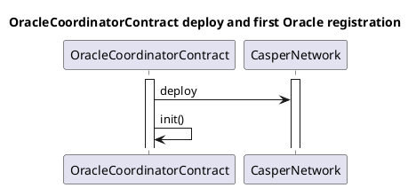

During deployment, the following parameters must be defined:

| Parameter        | Value      | Description                                                                       |
| ---------------- | ---------- | --------------------------------------------------------------------------------- |
| REWARD_CHALLENGE | 10 CSPR    | The sum of caspers paid to do a challenge and shared to participants              |
| TIMEOUT_BLOCKS   | 600 BLOCKS | The number of Casper Network blocks to wait for a Oracle response                 |
| TIMEOUT_FINE     | 100 CSPR   | The amount of casper fined if an Oracle fails to answer to a request              |
| ORACLE_FUND      | 5000 CSPR  | A Oracle should deposit such an amount of casper in order to engage in challenges |
| DEVTEAM_ADDR      | [016f0344...](https://cspr.live/account/016f034446a207c0e61b7170a52cf4d5433abbc7ade5cd1e3849202137f046d3d4)  | The developer team's address   |
| DEVTEAM_SHARE    | 10 % | The percent of REWARD_CHALLENGE to be transferred to DEVTEAM and used to improving the system  |

# 3. Oracle Registration and Activation

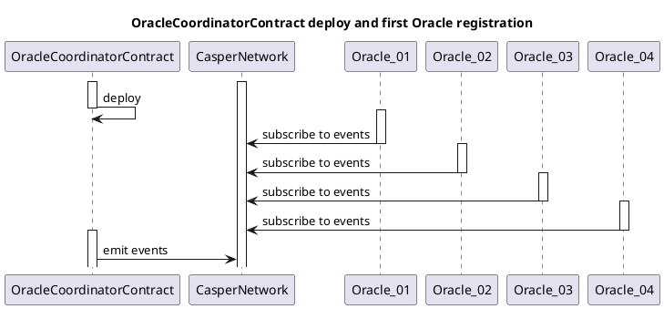

# 4. Events, Messages

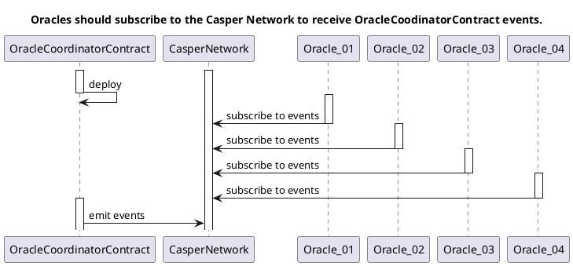

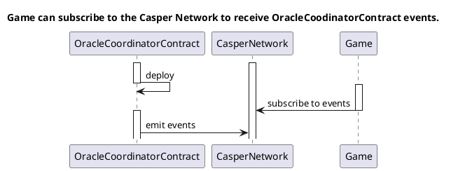

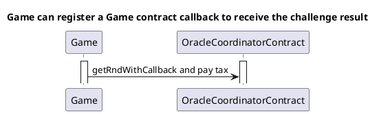

# 4. Game Challenge Flow

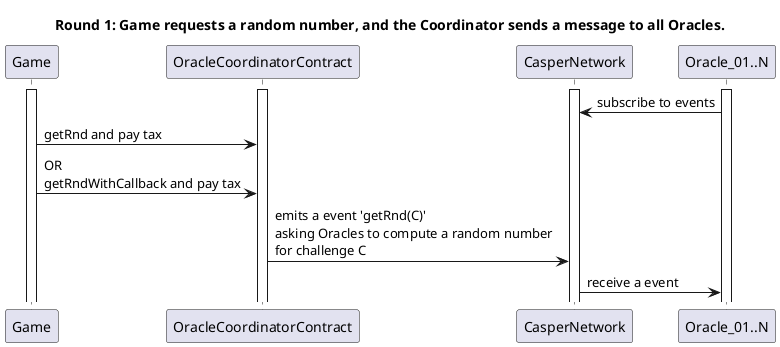

1. Each Oracle solves the challenge, encrypt and shares a secret with the result:
   1.1. Establish one different secure communication channel between each two participant:
      - ~~use RSA~~
      - use ECDH with the secp256k1 elliptic [link](https://docs.rs/k256/latest/k256/ecdh/index.html) to generate a shared key pair
      - ~~use AES128 for the data encryption & decryption~~
      - use chacha20poly1305 for the data encryption & decryption [link](https://docs.rs/chacha20poly1305/latest/chacha20poly1305/#)

   1.2. Resolve the challenge: choosing a random number Rnd
   1.3. Using the choosen Rnd as a secret build a SSSS Shamir Secret Sharing Scheme with one share for each other participant and with a threshold of the number of participants less 2. That will avoid the Last Actor atack: where the last participant to reveals their share can determine the impact of revealing, and thus decide to reveal or withhold their share, thus influencing the generated random number.
   1.4 Send the respective SSSS shares, encrypted with chacha20poly1305 using the ECDH shared key, to each other participant

2. Each Oracle reveals their secrets:
   2.1. OracleCoodinatos asks for Oracles to reveal their secrets
   2.2. Each Oracle reveals their secrets
   2.3. OracleCoodinator checks and rebuild the Rnd number of each Oracle with published shared
   2.4. OracleCoodinator compute the final random number with a XOR of each Oracle Rnd

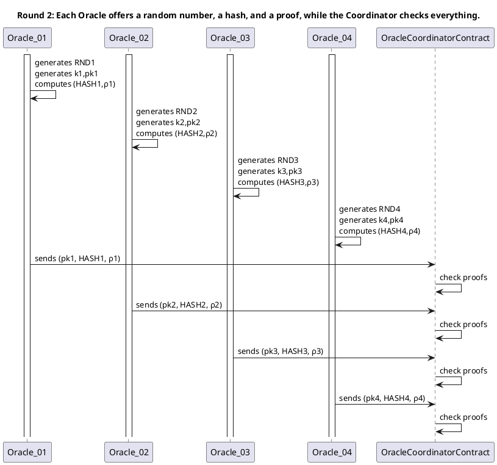

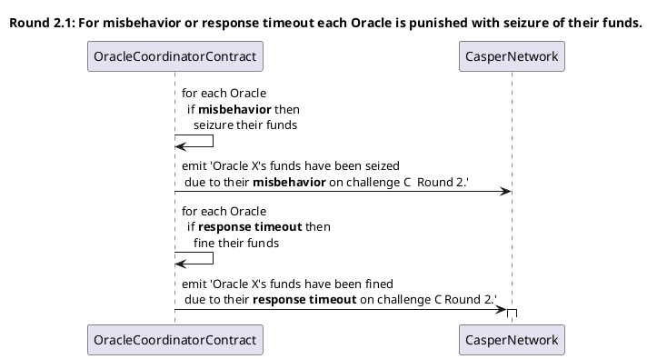

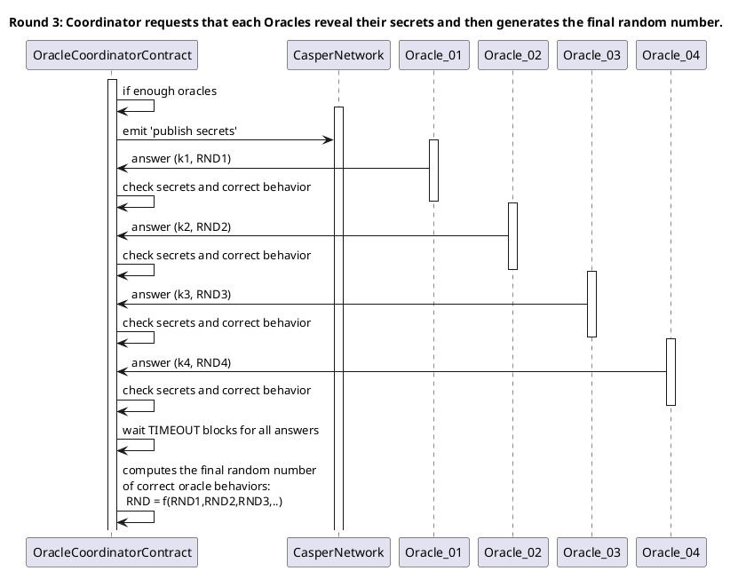

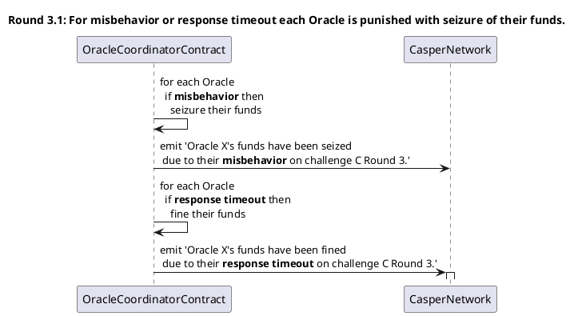

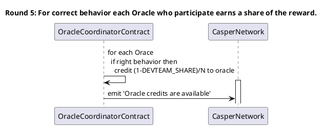

# 4.1 Oracle

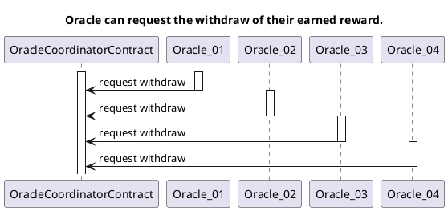

